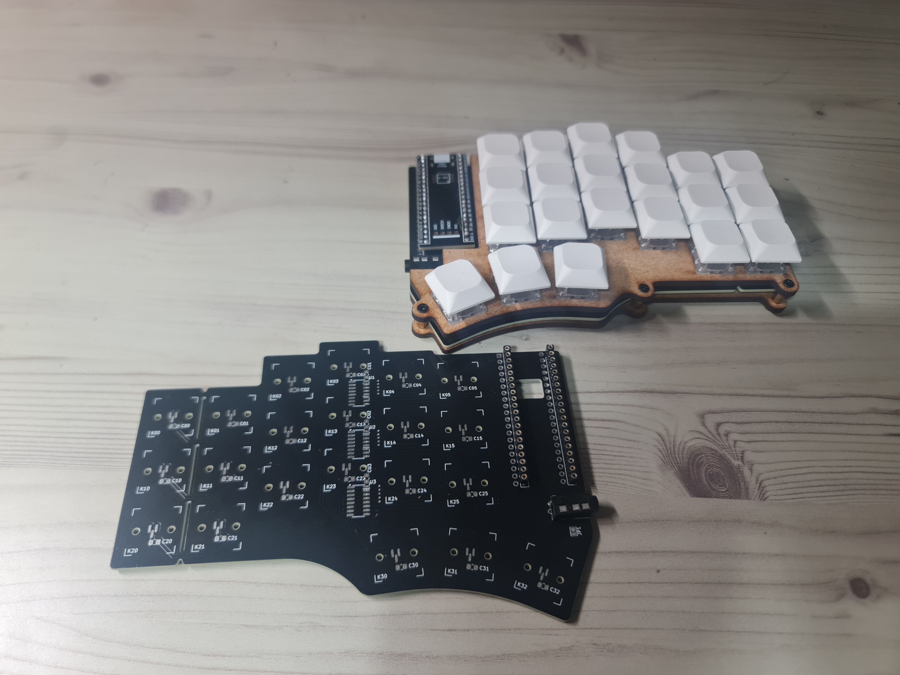
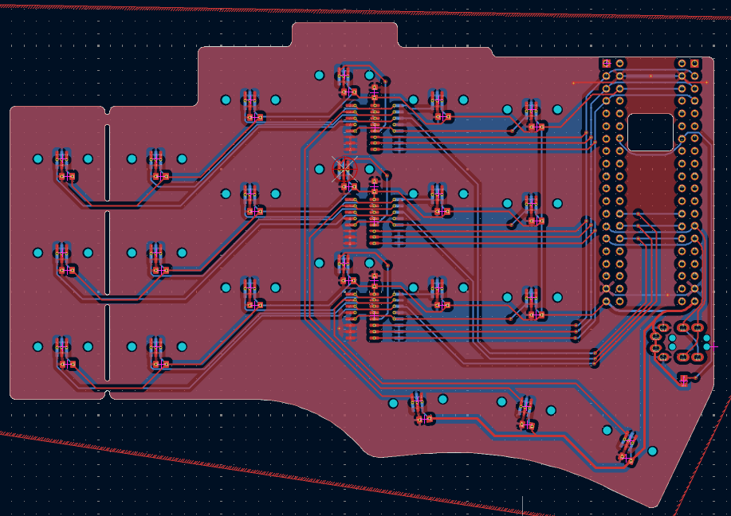

# cantor-HE
42 key column staggered split, now with hall effect (WIP)

> Warning! The hardware should work fine, but firmware was not verified yet due to flashing issue.

Hall-effect variant of [Cantor](https://github.com/diepala/cantor), a 42-key split keyboard.

Wooting compatible, reversible, qmk/vial support, and sharing PCB dimension with official Cantor

Firmware / schematics based on [TrueStrike42](https://github.com/byungyoonc/TrueStrike42)

## Preparation

### Board
| Component            | Qty |
| -------------------- | --- |
| PCB                  | 2   |
| SOT-23 SS49E         | 42  |
| SOIC-16 74HC4051(D)  | 6   |
| 0805 0.1uf capacitor | 48  |
| PJ320A TRRS socket   | 2   |
| Blackpill MCU        | 2   |
- For capacitor, 0.1~1uf should be fine
- And obviously, USB-C cable of your choice (with machine) and TRS/TRRS cable of your choice

### Case
- Option A: 3D printed case (I bet you can find one for Cantor)
- Option B: Cheap plate cut
  - requires heat insert and standoff
  - 3T mdf panel of A4 size can fit 2x top & bottom plate
      - and costs about $1
  - plate file provided in this repo
- I do not think original barebone design will work well, as switches are not soldered / mechanically connected.

| Component                  | Qty |
| -------------------------- | --- |
| M2 screw 6mm               | 12  |
| M2 heat insert 3*3         | 12  |
| M2 standoff 7mm + 3mm head | 12  |
- Flathead screw was used
- Standoff can be shorter or longer - but I recommend 5mm at least

### Switches
| Component                          | Qty |
| ---------------------------------- | --- |
| Wooting compatible magnetic switch | 42  |
- While those without side pins should be fine, I'd use one with side pins so that they fix better
- Firmware fix may be required to use the opposite polarity

## [Build guide](GUIDE.md)
WIP. You may check images folder / [Boardloaf-HE's build guide](https://github.com/Hanthebot/Boardloaf-HE/blob/main/GUIDE.md). 

\+ jump back for side detection, firmware is shared between halves

Almost the only difference is that you can solder SOIC-16 multiplexor on either side, preferably at the back of the keyboard.

## Features
- Supports both APC and rapid trigger
- Cheap, simple, and working
- 3 multiplexor on each side, scanning 7 keys per mux

## Changes from Boardloaf-HE
- full duplex communication
- reversible SOIC-16 footprint
- except that, firmware remains largely identical.
- STM32F4x1 MCU, so key precision is expected to have been improved by ~= 10x

## Remarks
- Initial config recommendation: 30% / 20% / 20% / 10% / 10% / 20% (APC act / release; RT init dead / act offset / release offset / bottom dead)
- More documentation: to be done
- Case
  - if your case works for official Cantor, it must work for this
- Random
  - PCB schematics are almost directly from TrueStrike42

## Sponsorship
PCB was generously sponsored by [PCBWay](https://www.pcbway.com/)! Their PCB was indeed of high quality. I did not go with options like matte coating or ENIG, but the board was generally better.

Apart from their great quality, what I felt different was their customer service. There were real human involved in production / communication process and you could feel that they want to help you. In the world filled by chatbot / hallucination, such experience is very rare indeed.

If you are designing a PCB & want some human to check it beforehand, I think PCBWay is superb. They will save you trial and errors.

## Licenses
All code under firmware folder, along with HW, follows GPL v3.
- inherited from TrueStrike42 / Cantor respectively.
- reversible SOT23 / SOIC-16 footprint can be used with MIT.

Webapp follows MIT license.

## Disclaimer
Webapp and firmware (modification) were vibe coded.

Firmware needs future check.
